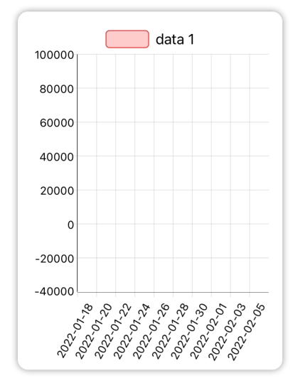
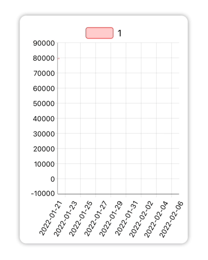
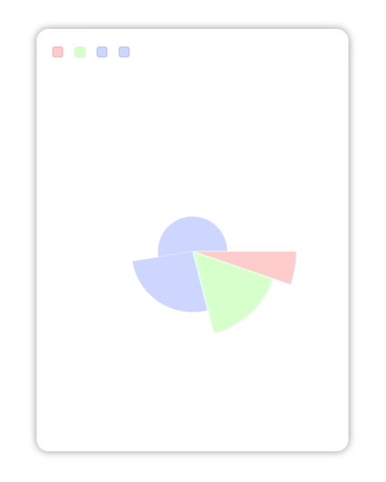

# ChartUI

A multiplatform `SwiftUI` chart framework.

  

## Features

* Bar charts
  * Multiple Bar charts


- Line charts
  - Multiple Line charts

- Pie charts


## Usage

### Installation

In Xcode go to `File -> Add Packages...` and paste in the repo's url: `https://github.com/Chocoford/ChartUI`

### basic usage

```swift
<#T##AnyChart#>() // BarChart(), LineChart(), PieChart()
    .data(<#T##ChartDataset#>)
    .options(.default)
```

### Data structures

a dataset contains `labels` and `data`, they are both `array`.

#### example

```swift
var labels: [String] = {
    var result: [String] = []
    for i in 0..<5 {
        result.append(String(format: "2021-01-%.2i", i))
    }
    return result
}()
var data: ChartData = ChartData(data: [1, 2, 3, 4, 5],
                                label: "data 1",
                                backgroundColor: ChartColor.primary)
var dataset: ChartDataset = .init(labels: labels, data: [data])
```


## Example


## License

**`ChartUI` is released under the terms of the [MIT](./LICENSE) license.**

## Acknowledgement

* [AppPear](https://github.com/AppPear)/[ChartView](https://github.com/AppPear/ChartView) for starting. (yes, we start from forking it)
* [chartjs](https://github.com/chartjs)/[Chart.js](https://github.com/chartjs/Chart.js) for api design inspiration

